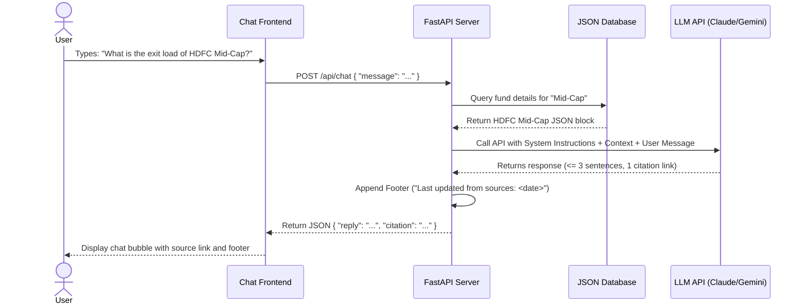

# System Architecture - Mutual Fund FAQ Assistant

This document outlines the architecture for the **Mutual Fund FAQ Assistant**, a lightweight, facts-only RAG (Retrieval-Augmented Generation) application designed to answer objective queries about HDFC Mutual Fund schemes using Groww as the reference context.

---

## Architecture Overview

The system is designed with a **decoupled client-server architecture**:
- **Frontend**: A highly responsive, single-page chat interface built with modern vanilla HTML, CSS, and JavaScript.
- **Backend**: A Python FastAPI server handling requests, retrieving context from a local JSON database, prompting the LLM, and enforcing compliance rules.
- **Offline Data Pipeline**: A python parsing script that extracts structured facts from raw Groww HTML pages to create a deterministic factual corpus.

```mermaid
graph TD
    subgraph Data Ingestion Pipeline (Offline)
        Scheduler[Daily Scheduler] -->|Triggers at midnight| Ingestion[Ingestion Component]
        Source[Groww HDFC Fund Pages] -->|parse_funds.py| Ingestion
        Ingestion --> JSON[(mutual_funds_data.json)]
    end

    subgraph Client Interface (User Browser)
        UI[Chat UI HTML/CSS/JS] -->|1. Submit Message| Server[FastAPI Router]
        Server -->|6. JSON Response| UI
        UI -->|Local Text Validation| UI
    end

    subgraph Backend Server (FastAPI)
        Server -->|Sanitize Input| PII[PII Detector & Filter]
        PII -->|Analyze Query Intent| Advisory{Advisory/Non-Factual Query?}
        
        Advisory -->|Yes| Refusal[Refusal Routing Engine]
        Refusal -->|Formulate Refusal + Educational Link| Server
        
        Advisory -->|No| RAG[RAG Retrieval Engine]
        RAG -->|Extract Keyword/Fund Name| DB[JSON DB Lookup]
        JSON -.->|Read Fund Data| DB
        DB -->|Structured Fund Metrics| RAG
        
        RAG -->|Assemble Prompt| Prompt[System Prompt Builder]
        Prompt -->|Factual Context + Instructions| LLM[LLM Client Claude/Gemini]
        LLM -->|Raw Response| PostProc[Post-Processing & Validation]
        
        PostProc -->|Enforce max 3 sentences| PostProc
        PostProc -->|Verify citation link| PostProc
        PostProc -->|Append last-updated footer| PostProc
        PostProc --> Server
    end
```

---

## Core Components

### 1. Data Ingestion & Offline Parser
Instead of scraping live Groww pages at runtime (which is slow, fragile, and prone to rate limits or formatting changes), we utilize an offline parser triggered by a daily scheduler.
- **Scheduler**: A daily cron-style scheduler triggers the ingestion component at midnight (or a configurable time) to keep fund data fresh without manual intervention.
- **Ingestion Component**: Orchestrates the full fetch-and-parse cycle — fetches the latest HTML from Groww, runs the parser, and overwrites the JSON database atomically.
- **Source**: Raw HTML content fetched from the 5 designated HDFC mutual fund URLs.
- **Parser (`scripts/parse_funds.py`)**: Uses Python's standard `html.parser` to traverse the HTML tree, locate the `About` card, details table, and key metrics.
- **Output (`data/mutual_funds_data.json`)**: A clean, structured database containing fields such as NAV, Min SIP, AUM, Expense Ratio, Exit Load, Benchmark Index, Fund Manager, and Investment Objective.

### 2. Backend Server (`backend/main.py`)
Built with **FastAPI**, the backend acts as the orchestrator and compliance gatekeeper.
- **Endpoints**:
  - `GET /api/funds`: Exposes metadata about the 5 schemes and 3 suggested example questions.
  - `POST /api/chat`: Takes a user's prompt, retrieves relevant fund details, and calls the LLM.
- **In-Memory Retrieval (Deterministic RAG)**:
  Since the database contains exactly 5 funds, we do not require a vector database. Instead, the backend performs a fast keyword lookup (e.g., matching "mid-cap", "defence", "large-cap", "small-cap", or "gold") to retrieve the exact matching fund's JSON block. If no specific fund is matched, the full database context is injected as system prompt context.

### 3. LLM Orchestration & Prompt Engineering
To ensure compliance with the "Facts-Only" constraints, the backend formats the request to the LLM (Claude/Gemini) using a highly structured prompt:
- **System Prompt**: Embeds the retrieved mutual fund JSON. It instructs the LLM that it is a *Facts-Only Q&A Assistant* and enforces:
  - **No Investment Advice**: Refuse opinions, recommendations, or performance comparisons.
  - **Formatting Constraints**: Limit response to **maximum of 3 sentences**, include **exactly one source citation link**, and append the required **last-updated footer**.
- **User Prompt**: The user's message is sent verbatim.

### 4. Refusal Handling System
If the user's query asks for advice (e.g., *"Should I invest in this fund?"*) or comparisons (e.g., *"Which fund is better?"*), the system bypasses standard RAG response generation or instructs the LLM to trigger a structured refusal.
- **Refusal Response**: 
  1. A polite explanation reinforcing the facts-only limitation.
  2. A direct link to official educational resources (SEBI Investor Education or AMFI India).

### 5. Frontend UI (`frontend/`)
Designed to match **Groww's styling guidelines** with premium vanilla CSS:
- **Welcome & Setup**: Displays a disclaimer bar, welcome message, and 3 clickable quick-question pills.
- **Theme Support**: Seamless transitions between light and dark modes.
- **Micro-Animations**: Smooth chat message slide-ins, loading spinners, and hover transitions.
- **Responsive Layout**: Fluid layouts that adapt beautifully to desktops, tablets, and mobile screens.

---

## Detailed Information Flow

The sequence diagram below shows the end-to-end flow of a user query:



---

## Security & Compliance Design

The architecture strictly adheres to Groww's regulatory guidelines:
- **Zero PII Collection**: The frontend has no fields for, and the backend completely ignores/strips, sensitive inputs such as PAN, Aadhaar, account numbers, email addresses, phone numbers, or OTPs.
- **Advisory Guardrails**: No generative return calculations or performance comparisons are allowed. If requested, the system returns a direct citation link to the official factsheet.
- **Verifiable Citations**: Every factual response contains exactly one link originating from the verified Groww/official corpus, ensuring traceability.
